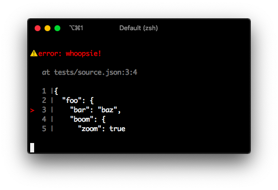

<div align="center">
  🧙‍♀️🔮
</div>
<h1 align="center">
  source-error
</h1>

<p align="center">
   a magical type for displaying source file errors
</p>

<div align="center">
  
</div>

<div align="center">
  <a href="https://github.com/softprops/source-error/actions">
    
  </a>
  <a href="https://crates.io/crates/source-error">
    
  </a>
  <a href="http://docs.rs/source-error">
    
  </a>
  <a href="https://softprops.github.io/source-error">
   
  </a>
  <a href="LICENSE">
    
  </a>
</div>

<br />

## 📦 install

Add the following to your `Cargo.toml` file's `[dependencies]` heading

```toml
[dependencies]
source-error = "0.1"
```

## 🤸 usage

> 🚧 Interfaces are not yet finalized and are subject to change

This crate is intended as a visual reporting diagnostic for tools which operate on text sources.

The `source_error::Error` type provides a helpful [`Display`](https://doc.rust-lang.org/std/fmt/trait.Display.html) and can be used on in any [`Error`](https://doc.rust-lang.org/std/error/trait.Error.html) context

```rust
use source_error::{from_file, Position};
use std::error::Error;

fn main() -> Result<(), Box<dyn Error>> {
    println!(
        "{}",
        from_file(
            "whoopsie!",
            "path/to/some/file.json",
            Position::new(3, 4)
        )?
    );
    Ok(())
}
```

Doug Tangren (softprops) 2019